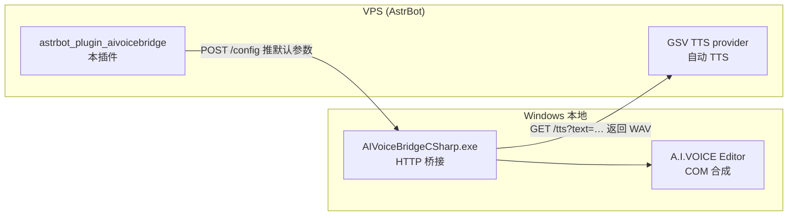

# astrbot_plugin_aivoicebridge

配合本地 [AIVoiceBridge](https://github.com/CyanYuzu/AIVoiceBridge) 桥接服务使用的 AstrBot 插件, 用于**调整 A.I.VOICE 的合成参数**(音色 / 音量 / 话速 / 音高 / 抑扬 / 停顿). 

## 背景

自动 TTS 由 AstrBot **内置的 GSV TTS provider**(`gsv_tts_selfhost`)完成, 但它只会向本地桥接发送 `text`, **无法传递音色、音量、话速等参数**. 本插件把这些参数推送到桥接的 `GET/POST /config` 接口, 桥接会将其作为**持久化默认参数**; 此后 GSV provider 每次无参调用 `/tts` 时, 合成使用的就是这份默认参数 —— 从而达成“在 AIVoice 作为 TTS 源时调整其参数”. 

## 架构

## 依赖

- 本地 AIVoiceBridgeCSharp 桥接服务(需支持 `GET/POST /config`, 见其 README)
- SSH 反向隧道连通(VPS 能访问 `127.0.0.1:18765`)

## 安装

1. 将本目录复制到 VPS 的 `AstrBot/data/plugins/astrbot_plugin_aivoicebridge/`(或在 WebUI 插件市场安装). 
2. 在 AstrBot WebUI 插件管理中启用并**重载插件**(安装时自动通过 `requirements.txt` 安装 `httpx`). 

## 配置(WebUI 可视化)

| 配置项 | 说明 | 默认 |
|--------|------|------|
| `api_base` | 桥接地址 | `http://127.0.0.1:18765` |
| `voice` | 默认音色预设名 | `紲星 あかり(蕾)` |
| `volume` | 音量 (0.00~5.00) | 1.0 |
| `speed` | 话速 (0.50~4.00) | 1.0 |
| `pitch` | 声调高低 (0.50~2.00) | 1.0 |
| `pitch_range` | 抑扬/强调程度 (0.00~2.00) | 1.0 |
| `middle_pause` | 句中短停顿 ms (80~500, 仅日语) | 150 |
| `long_pause` | 句中长停顿 ms (80~2000, 仅日语) | 370 |
| `sentence_pause` | 句末停顿 ms (0~10000, 仅日语) | 800 |
| `auto_push` | 插件启动时自动推送配置 | true |

> 留空的参数项不会被推送, 不会覆盖桥接中已有的其他设置. 

## 指令

- `/aivoice` 或 `/aivoice status`：查看桥接当前生效的默认参数
- `/aivoice push`：将插件配置推送到桥接(修改配置后执行, 使改动立即生效)

> 提示：修改插件配置后需**重载插件**或在聊天中发送 `/aivoice push` 使改动生效. 

## 支持

- [AstrBot](https://github.com/AstrBotDevs/AstrBot)
- [AstrBot 插件开发文档](https://docs.astrbot.app/dev/star/plugin-new.html)
- [A.I.VOICE API文档](https://aivoice.jp/manual/editor/api.html)
